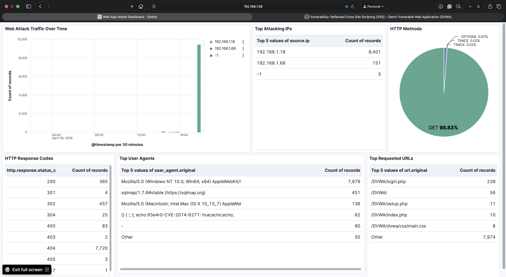
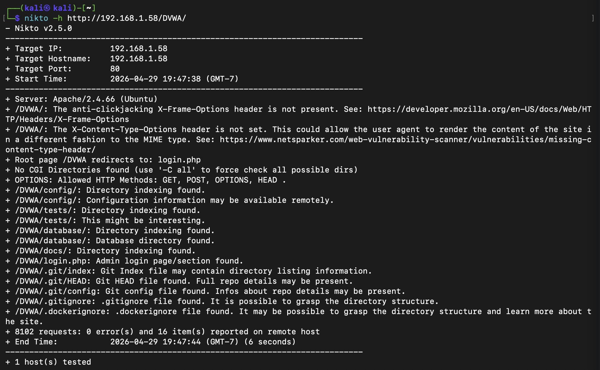
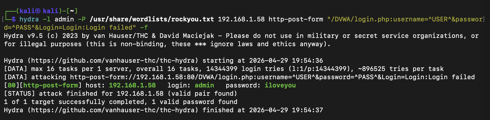
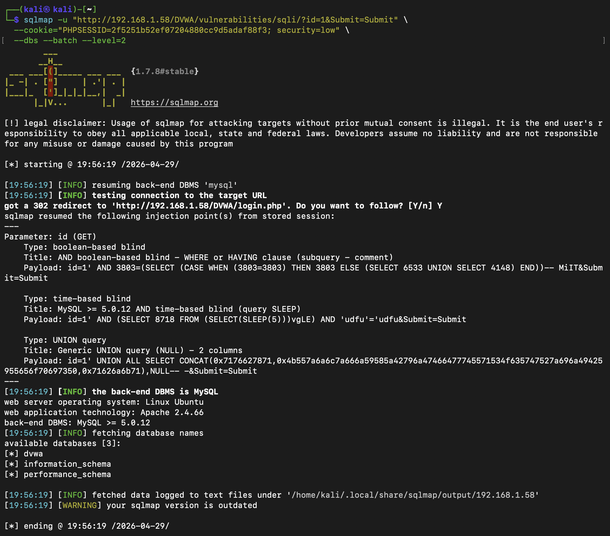
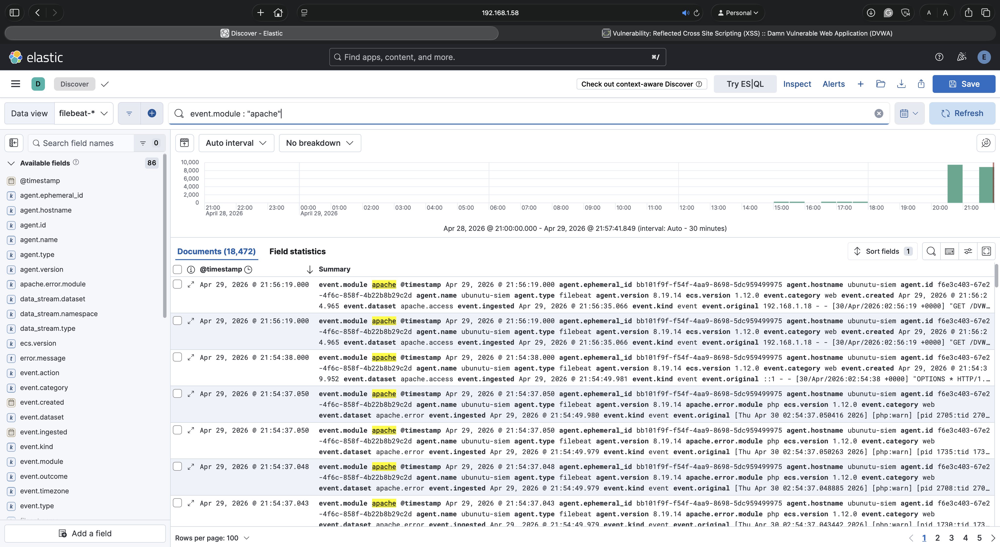
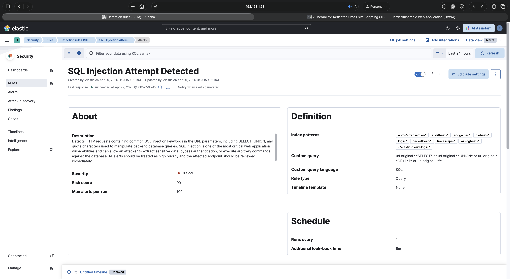

# Web Application Attack Lab

A home SOC lab simulating real-world web application attacks against a deliberately vulnerable target, with full log ingestion, detection rules, and a Kibana dashboard built on top of the attack data.

## Overview

This lab sets up DVWA (Damn Vulnerable Web Application) as a target and runs six categories of attacks from both a browser and a Kali Linux VM. All traffic is logged by Apache and shipped to Elasticsearch via Filebeat for detection and analysis in Kibana.

**Target:** DVWA on Ubuntu 26.04 ARM64  
**Attack platform:** Kali Linux 2023 ARM64  
**Log pipeline:** Apache → Filebeat → Elasticsearch → Kibana  
**Host:** Apple Mac Mini M4, 32GB RAM, macOS (UTM virtualization)

---

## Lab Environment

| VM | IP | OS | Role |
|----|----|----|------|
| Ubuntu-SIEM | 192.168.1.58 | Ubuntu 26.04 ARM64 | Target / SIEM host |
| Kali Linux | 192.168.1.18 | Kali 2023 ARM64 | Attack platform |

**Stack versions:**
- Elasticsearch 8.19.14
- Kibana 8.19.14
- Filebeat 8.19.14
- Apache 2.4.66

---

## Attacks Performed

| Attack | Tool | Result |
|--------|------|--------|
| SQL Injection (manual) | Browser | Dumped all users and MD5 hashes |
| Command Injection | Browser | RCE as www-data, dumped /etc/passwd |
| XSS Reflected | Browser | Script executed in browser |
| Web Scanner | Nikto | 16 findings, 8,102 requests in 6 seconds |
| Brute Force | Hydra + rockyou.txt | Credentials found in 8 attempts |
| Automated SQLi | SQLmap | 3 injection types, 3 databases enumerated |

---

## Screenshots

### Kibana Dashboard

### Nikto Web Scanner

### Hydra Brute Force

### SQLmap Automated Injection

### Kibana Apache Logs

### Detection Rule - SQL Injection

---

## Detection Rules

Three detection rules were created in Kibana Security under the `filebeat-*` index, each running on a 1-minute schedule with a 5-minute look-back window.

**Web Scanner Detected**  
Threshold rule — triggers when a single source IP exceeds 100 requests per minute against the application. Catches automated scanner behavior like Nikto.

**SQL Injection Attempt**  
Custom query rule — triggers on URL parameters containing SQL keywords including SELECT, UNION, and quote characters. Caught 166 events across manual and automated injection tests.

**Brute Force Login**  
Threshold rule — triggers when a single source IP sends more than 10 POST requests to the login page within 1 minute. Hydra generated 239 POST requests in under 15 seconds.

---

## Kibana Dashboard

The Web App Attack Dashboard uses the `filebeat-*` index filtered to `event.module: apache` and contains six panels:

- **Web Attack Traffic Over Time** — bar chart split by source IP showing the Nikto spike
- **Top Attacking IPs** — Kali at 9,401 requests vs host browser at 151
- **HTTP Response Codes** — breakdown of 200s, 302s, 404s, and 500s
- **HTTP Methods** — pie chart showing GET at 98.83% and POST at 0.97%
- **Top Requested URLs** — login page, DVWA root, setup and index pages
- **Top User Agents** — sqlmap/1.7.8, Nikto/2.5.0, CVE-2014-6271 Shellshock probe string

---

## Key Findings

- No input validation on any tested DVWA parameter — SQL injection and command injection required no tools beyond a browser
- Admin account used a weak password found in rockyou.txt within 8 attempts — no lockout policy was in place
- Nikto identified an exposed `.git` directory including HEAD and config files
- The `/DVWA/config/` and `/DVWA/database/` directories were publicly accessible with directory indexing enabled
- SQLmap confirmed three distinct injection techniques against the same parameter
- Nikto probed for Shellshock (CVE-2014-6271), leaving a distinctive user agent string in Apache logs

---

## Files

| File | Description |
|------|-------------|
| `web_app_attack_lab_report.docx` | Full lab report |
| `filebeat.yml` | Filebeat configuration used for Apache log ingestion |
| `dashboard_export.ndjson` | Kibana dashboard export |
| `detection_rules_export.ndjson` | Kibana detection rules export |
| `web-attack-dashboard.png` | Dashboard screenshot |
| `nikto_scan.png` | Nikto scan output |
| `hydra_brute_force.png` | Hydra brute force output |
| `sqlmap_output.png` | SQLmap injection output |
| `kibana_apache_logs.png` | Kibana Discover showing Apache logs |
| `detection_rule_sql_injection.png` | SQL injection detection rule |

---

## Related Labs

- [SOC/SIEM Detection Lab](https://github.com/jsmith-sec/soc-home-lab)
- [Incident Response Simulation](https://github.com/jsmith-sec/incident-response-lab)
